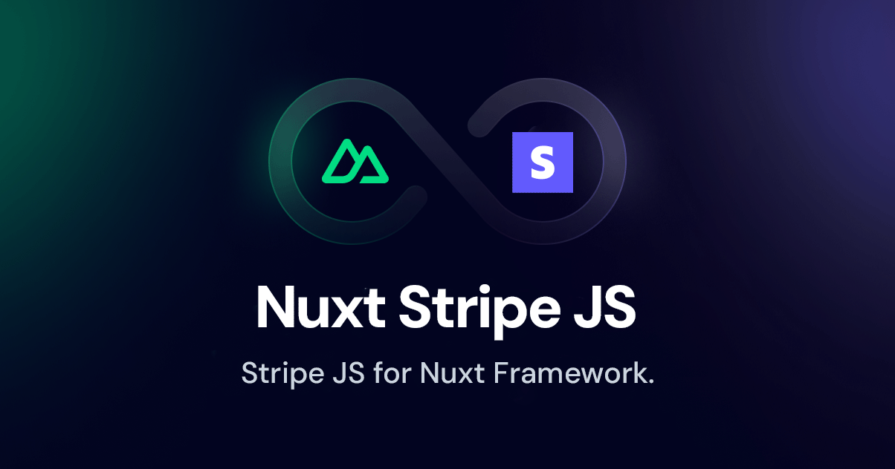

[](https://image.nuxt.com)

[![npm version][npm-version-src]][npm-version-href]
[![npm downloads][npm-downloads-src]][npm-downloads-href]
[![License][license-src]][license-href]
[![Nuxt][nuxt-src]][nuxt-href]

# Nuxt Stripe JS

Vue components for Stripe.js and Stripe Elements in Nuxt applications.

- [✨ &nbsp;Release Notes](/CHANGELOG.md)
<!-- - [🏀 Online playground](https://stackblitz.com/github/asonnleitner/nuxt-stripe-js?file=playground%2Fapp.vue) -->
<!-- - [📖 &nbsp;Documentation](https://example.com) -->

## Features

- 🔌 &nbsp;Easy integration with Stripe.js
- 🧩 &nbsp;Vue components for all Stripe Elements
- ⚡️ &nbsp;Reactive options and state management
- 🔄 &nbsp;Auto-updating Elements when options change
- 🛡️ &nbsp;TypeScript support with full type definitions

## Quick Setup

Install the module to your Nuxt application with one command:

```bash
# Using NPX
npx nuxi module add nuxt-stripe-js

# Or with your package manager
npm install nuxt-stripe-js
pnpm add nuxt-stripe-js
yarn add nuxt-stripe-js
```

Add it to your `nuxt.config.ts` file:

```ts
export default defineNuxtConfig({
  modules: [
    'nuxt-stripe-js'
  ]
})
```

## Usage

You need to load the Stripe.js library first:

```ts
import { loadStripe } from '@stripe/stripe-js'

// Use your Stripe publishable key
const stripePromise = loadStripe('pk_test_your_key')
```

Then use the components in your Vue template:

```vue
<template>
  <Elements :stripe="stripePromise">
    <CardElement @change="handleChange" />
    <!-- Other Stripe elements are also available -->
  </Elements>
</template>
```

## Available Components

The module provides components for all Stripe Elements:

- `<Elements>` - The provider component (required)
- `<CardElement>` - Complete card input
- `<CardNumberElement>` - Card number input
- `<CardExpiryElement>` - Card expiry date input
- `<CardCvcElement>` - Card CVC input
- `<PaymentElement>` - Smart payment method selector
- `<PaymentRequestButtonElement>` - Apple Pay/Google Pay button
- `<ExpressCheckoutElement>` - Express checkout options
- And many more...

## Contribution

<details>
  <summary>Local development</summary>

  ```bash
  # Install dependencies
  pnpm install

  # Generate type stubs
  pnpm run dev:prepare

  # Develop with the playground
  pnpm run dev

  # Build the playground
  pnpm run dev:build

  # Run ESLint
  pnpm run lint

  # Run Vitest
  pnpm run test
  pnpm run test:watch

  # Release new version
  pnpm run release
  ```

</details>

<!-- Badges -->
[npm-version-src]: https://img.shields.io/npm/v/nuxt-stripe-js/latest.svg?style=flat&colorA=020420&colorB=00DC82
[npm-version-href]: https://npmjs.com/package/nuxt-stripe-js

[npm-downloads-src]: https://img.shields.io/npm/dm/nuxt-stripe-js.svg?style=flat&colorA=020420&colorB=00DC82
[npm-downloads-href]: https://npm.chart.dev/nuxt-stripe-js

[license-src]: https://img.shields.io/npm/l/nuxt-stripe-js.svg?style=flat&colorA=020420&colorB=00DC82
[license-href]: https://npmjs.com/package/nuxt-stripe-js

[nuxt-src]: https://img.shields.io/badge/Nuxt-020420?logo=nuxt.js
[nuxt-href]: https://nuxt.com
